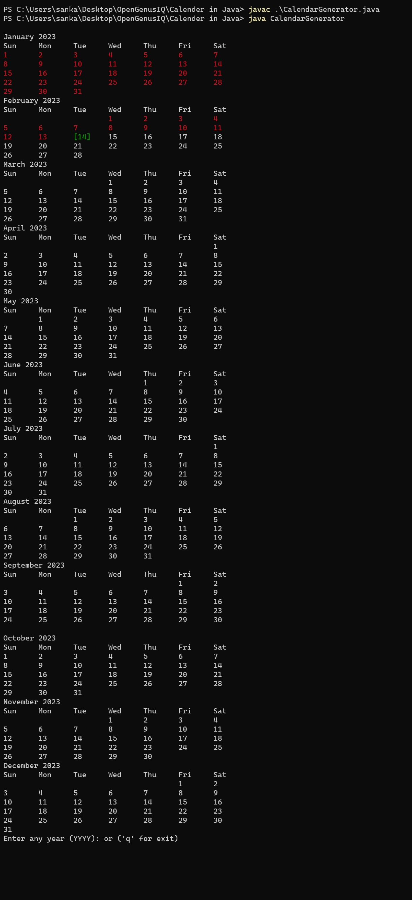

# **Calender in JAVA**


## Getting Started


**CalendarGenerator** is a Java program that generates a calendar for a specified year. It allows the user to enter any year and generates the corresponding calendar for that year.

## Functionality
* The generateCalendar method generates a calendar for a specified year. It first gets the current date and extracts the year, month, and day information from it. It then creates a Calendar instance set to the specified year.

* The method loops through each month and prints the name of the month and the days of the week. It sets the calendar to the current month, gets the day of the week for the first day of the month, and loops through the days of the week until it reaches the first day of the month.

* It then gets the last day of the month and loops through each day of the month. If the current date is today, it prints it in green. If the current date is in the past, it prints it in red. Otherwise, it prints it in the default color.

* The program uses the Scanner class to get input from the user. It asks the user to enter a year, and the program generates the corresponding calendar for that year.

## Prerequisities

You need to have the following software installed on your system:

* Java (1.8 or later)

## Installing

Clone : ```git clone https://github.com/OpenGenus/calendar-in-java.git```

or download the repository (zip file) to your local machine.

## Running

1. Compile the CalendarGenerator.java file using the Java compiler.

```java
javac CalendarGenerator.java
```

2. Run the CalendarGenerator class using the Java Virtual Machine.
```java
java CalendarGenerator
```
3. The program will display the calendar for the current year. You can enter any year to display the calendar for that year.

4. To exit the program, enter 'q'.

## Example Output
* Below image shows the output generated on 14-02-2023.


